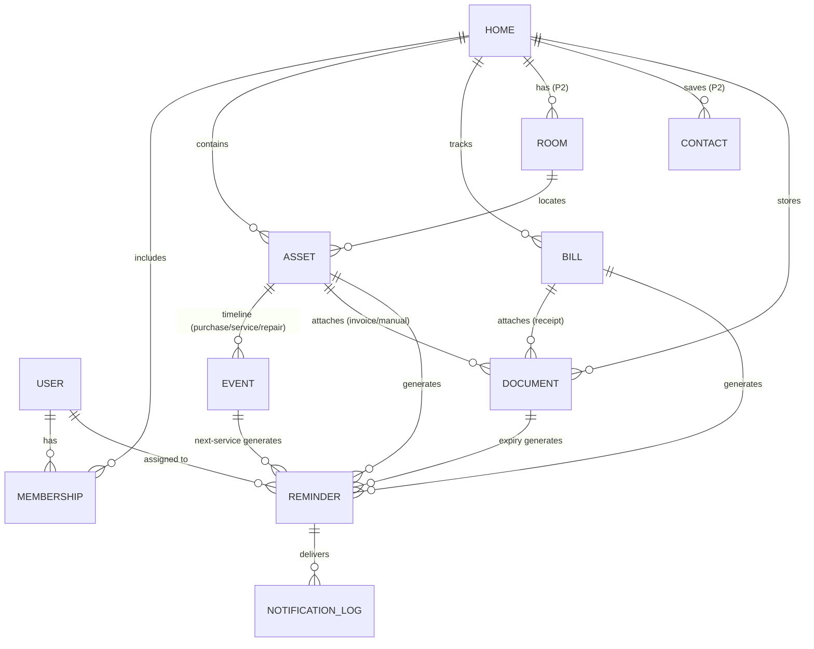

# 03 — Architecture & Data Model

## Stack Decisions

| Layer | Choice | Why |
|-------|--------|-----|
| App framework | **Flutter** (Dart, stable channel) | One codebase; India-first = Android-first, iOS later for free; 60fps UI; strong offline story |
| State management | **Riverpod** (with codegen) | Testable, compile-safe DI + state; scales to feature-first modules |
| Navigation | **GoRouter** | Deep links (QR → asset card, notification → task) are first-class requirements |
| Local DB | **Drift (SQLite)** | Offline-first source of truth; relational fits our model (assets↔reminders↔events); reactive queries drive UI |
| Sync/backend | **Firebase**: Auth, Firestore, Cloud Storage, FCM, Crashlytics, Analytics, Remote Config | Zero backend ops for a small team; free tier covers MVP; per-home security rules |
| Server logic | **Cloud Functions** (minimal) | Invite-link redemption, scheduled FCM for cross-device reminders, monthly report generation |
| OCR / Barcode | **ML Kit** (on-device) | Free, offline, supports Devanagari; privacy-friendly (images never leave device for OCR) |
| Notifications | flutter_local_notifications + FCM | Local = reliable offline reminders; FCM = family escalation & cross-device |
| CI/CD | GitHub Actions → Firebase App Distribution → Play Console | Automated from Sprint 0 |

**Firestore exit path** (if costs bite at scale): repository pattern isolates sync; Drift schema is canonical; Supabase/Postgres migration is a sync-adapter swap, not an app rewrite. Revisit at 100k MAU.

## Architecture Style

Feature-first Clean Architecture. Local DB is the **single source of truth**; UI never waits on network.

```
UI (Flutter widgets, Riverpod providers)
   ↓ watches
Application layer (controllers/notifiers, use-cases)
   ↓ calls
Domain (entities, business rules — pure Dart, no deps)
   ↓ implemented by
Data (repositories → Drift DAO + Firestore sync adapter + Storage)
```

### Folder structure

```
lib/
  core/            # theme, router, l10n, utils, error handling, constants
  data/
    local/         # drift database, tables, DAOs
    sync/          # firestore adapters, sync queue, conflict resolution
    services/      # auth, storage, notifications, ocr, analytics
  domain/          # entities, value objects, repository interfaces
  features/
    onboarding/
    dashboard/
    assets/
    bills/
    maintenance/
    reminders/     # the engine — see doc 04
    family/
    documents/
    settings/
      # each: presentation/ (screens, widgets, providers)
      #        application/ (controllers, use-cases)
  main.dart
test/              # mirrors lib/; unit + widget; integration_test/ for flows
```

## Data Model (ERD)



Key modeling rules:
- **Reminders are rows, not code.** Any entity can own reminders via `(source_type, source_id)` — new modules get reminders for free.
- **EVENT is append-only** — the asset timeline and service history are the same table.
- **DOCUMENT is polymorphic attachment** — one table serves assets, bills, and the Phase-2 standalone vault (nullable `category`, `expiry_date`).
- Every row: `id (uuid)`, `home_id`, `created_by`, `created_at`, `updated_at`, `deleted_at` (soft delete → sync-safe), `sync_status`.

## Offline-First Sync

```
Write path:  UI → Drift (instant) → outbox row → sync worker → Firestore
Read path:   UI ← Drift reactive query ← Firestore listener applies remote changes
```

- **Outbox pattern**: every local mutation enqueues; worker drains with exponential backoff; safe across app kills.
- **Conflicts**: last-write-wins on `updated_at` per field-group for MVP; attachments are immutable (new upload = new file) so they can't be corrupted by conflicts. Conflict UI deferred to Phase 3.
- **Firestore layout**: `homes/{homeId}/assets/{id}`, `.../bills/{id}`, `.../reminders/{id}`… Security rules: membership in `homes/{homeId}/members/{uid}` required for read/write.
- **Attachments**: Cloud Storage `homes/{homeId}/attachments/{uuid}`; local thumbnail cache; lazy full-res download.

## Reminder Delivery (reliability-critical)

1. All reminders scheduled as **local notifications** on each member's device from synced reminder rows (survives offline).
2. A daily **Cloud Function sweep** sends FCM for anything a device might have missed (reinstall, new phone) and drives **family escalation** pushes.
3. Android: request exact-alarm + battery-optimization exemption with in-context explanation; test matrix must include aggressive OEMs (Xiaomi/Oppo/Vivo — a large share of Indian devices).

## Security & DPDP Compliance

- **Transport:** TLS only (Firebase default). **At rest:** Firestore/Storage server-side encryption; local DB via SQLCipher if threat model demands (decision Sprint 2 — default: OS sandbox + app lock).
- **App lock:** biometric/PIN via local_auth.
- **Data minimization:** no Aadhaar/PAN fields anywhere; address optional; SMS access (Phase 2) opt-in with declared purpose.
- **User rights:** account deletion = Cloud Function cascade-erases home data (when sole owner) + Storage files; export = JSON/CSV bundle (stub in MVP, full in Phase 3).
- **Consent:** first-run consent screen (analytics opt-out honored via Analytics toggle).

## Analytics & Quality Gates

Events from Sprint 1: `onboarding_step`, `first_asset_added`, `first_reminder_scheduled` (activation), `reminder_fired/actioned/snoozed`, `bill_marked_paid`, `family_invite_sent/accepted`, `session_start`. Funnels: onboarding → activation; reminder fired → actioned.

Quality bars (CI-enforced where possible):
- Unit + widget tests on domain and engine logic (reminder scheduling has **table-driven tests** — it's the product)
- Integration test: onboarding → add asset → reminder scheduled
- Cold start <2.5s on a low-end device (e.g., 3GB RAM Android); app size <30MB initial
- Crash-free sessions >99.5% before each release
